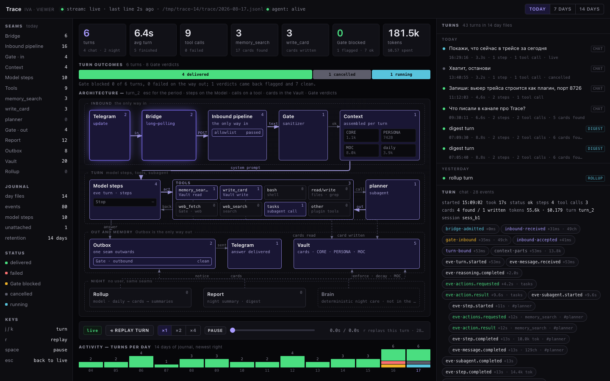

# trace

Viewer for Iva's Trace — the turn journal. One HTML page: the schema of Iva with the path of a
turn lit across it, equal tiles for the period, the list of turns for 14 days, the event feed of
one turn as chips, and a replay of any turn at real intervals.

The core writes the journal (`data/trace/YYYY-MM-DD.jsonl`, ADR-0010); this plugin only reads
it. Zero dependencies, no build step, loopback only.



## Install

```bash
iva plugin add trace
```

The service comes up as `iva-plugin-trace-viewer.service` on `127.0.0.1:8726`. Nothing is
exposed — reach it through an SSH tunnel:

```bash
iva trace open                                  # prints the two lines below
ssh -N -L 8726:127.0.0.1:8726 <user>@<host>
open http://127.0.0.1:8726
```

## Run it by hand

```bash
cd sh.iva/services/viewer
IVA_SERVICE_PORT=8726 IVA_DATA_DIR=/path/to/iva/data node server.mjs
```

Env, as the service contract defines it: `IVA_SERVICE_PORT` (loopback only), `IVA_DATA_DIR`
(the journal is `<IVA_DATA_DIR>/trace/`), `PLUGIN_ROOT`, `PLUGIN_DATA`.

## What the page shows

- **Tiles** for today / 7 days / 14 days: turns, average turn, tool calls, `memory_search` and
  the cards it found, `write_card`, Gate verdicts, tokens and cost.
- **Architecture**: Telegram → Bridge → Inbound pipeline (allowlist, Gate) → Context (CORE,
  PERSONA, MOC, daily) → Model steps → Tools → planner → Outbox (Gate) → Telegram, with the
  Vault beside them and the night band (Rollup, Report, Brain). The path of the selected turn
  stays lit for as long as it is selected, and the seam that failed goes red — a blocked Gate,
  a failed step, a Stop.
- **One scale at a time**: with a turn selected every box counts that turn and the title says
  which (`Architecture — turn_2`); let the turn go — click it again or press `esc` — and every
  box counts the period (`Architecture — today`). A box counts what its seam does: steps on the
  Model, calls on a tool, cards in the Vault, verdicts on a Gate. Brain carries no number at
  all: the journal has no `brain.*` event, and a zero there would be a lie.
- **Turns**: newest first, chat and night marked, with the day, the duration and the outcome.
  One eve session can hold several turns — the digest sends twice, a Rollup crosses midnight —
  and they stand in the list apart, as the contract says they should.
- **Feed**: every event of the turn as a chip (`kind·name`, offset, duration, sizes); click one
  to see its `data`, capped. Subagent steps are indented.
- **Replay**: plays the turn again on the schema at real intervals, ×1/×2/×4, with a scrub bar.
  The frame loop lives only while it plays: paused or finished, the page stops asking for frames
  and keeps its last one lit. `esc` steps back out of the replay, then out of the turn.
- **Status line**: two facts, two dots — `stream: live · last line Ns ago · <journal file> ·
  agent: alive`. The stream is between the page and this service; the agent is a different
  process, so it can be restarting while the journal reads fine.

No input field: you write in Telegram, you watch here. The only way into Iva stays the Inbound
pipeline.

## Routes

| Route                        | Answer                                                     |
| ---------------------------- | ---------------------------------------------------------- |
| `GET /`                      | the page, one file                                         |
| `GET /api/turns`             | stitched turns of the last 14 days, newest first           |
| `GET /api/turn?id=<id>`      | one turn with its events sorted by `ts`                     |
| `GET /api/stats?days=1\|7\|14` | tiles for the period, plus per-node counts                 |
| `GET /api/status`            | journal file, size, and whether the agent answers          |
| `GET /api/stream`            | SSE: `hello`, `line`, `rollover`                            |

The stitched window is held against the size and mtime of the day files, so a request that
changes nothing re-reads and re-stitches nothing. On a journal of 69k lines the first
`/api/turns` takes 250 ms, the next one 19 ms, and a fresh line costs 130 ms.

## Develop

```bash
node test/fixture.mjs /tmp/iva-data              # fourteen realistic days of journal
node test/fixture.mjs /tmp/iva-big --busy 370    # ~70k lines, for a load test
IVA_SERVICE_PORT=8726 IVA_DATA_DIR=/tmp/iva-data node sh.iva/services/viewer/server.mjs
node --test test/*.test.mjs                      # 35 cases, no dependencies
```

The fixture also says what it scripted, and the tests compare that plan with what the reader
finds: intent on one side, the stitched turn on the other. `sh.iva/` ships only what runs.

The journal contract lives in `docs/trace.md` of the Iva repo. The reader here follows that
file, not the writing code.
