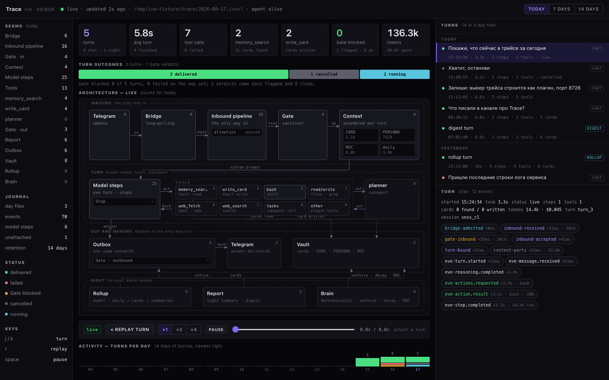

# trace

Viewer for Iva's Trace — the turn journal. One HTML page: the schema of Iva with the nodes and
edges lighting up as events arrive, equal tiles for the period, the list of turns for 14 days,
the event feed of one turn as chips, and a replay of any turn at real intervals.

The core writes the journal (`data/trace/YYYY-MM-DD.jsonl`, ADR-0010); this plugin only reads
it. Zero dependencies, no build step, loopback only.



## Install

```bash
iva plugin add trace
```

The service comes up as `iva-plugin-trace-viewer.service` on `127.0.0.1:8726`. Nothing is
exposed — reach it through an SSH tunnel:

```bash
iva trace open                                  # prints the two lines below
ssh -N -L 8726:127.0.0.1:8726 <user>@<host>
open http://127.0.0.1:8726
```

## Run it by hand

```bash
cd sh.iva/services/viewer
IVA_SERVICE_PORT=8726 IVA_DATA_DIR=/path/to/iva/data node server.mjs
```

Env, as the service contract defines it: `IVA_SERVICE_PORT` (loopback only), `IVA_DATA_DIR`
(the journal is `<IVA_DATA_DIR>/trace/`), `PLUGIN_ROOT`, `PLUGIN_DATA`.

## What the page shows

- **Tiles** for today / 7 days / 14 days: turns, average turn, tool calls, `memory_search` and
  the cards it found, `write_card`, Gate verdicts, tokens and cost.
- **Architecture**: Telegram → Bridge → Inbound pipeline (allowlist, Gate) → Context (CORE,
  PERSONA, MOC, daily) → Model steps → Tools → planner → Outbox (Gate) → Telegram, with the
  Vault beside them and the night band (Rollup, Report, Brain). Each node carries its count for
  the period; the path of the selected turn stays lit.
- **Turns**: newest first, chat and night marked, with the day, the duration and the outcome.
- **Feed**: every event of the turn as a chip (`kind·name`, offset, duration, sizes); click one
  to see its `data`, capped. Subagent steps are indented.
- **Replay**: plays the turn again on the schema at real intervals, ×1/×2/×4, with a scrub bar.
- **Status line**: `live · updated Ns ago · <journal file> · agent alive`. The viewer is its own
  process, so it survives a restart of the agent and says "agent restarting or unreachable".

No input field: you write in Telegram, you watch here. The only way into Iva stays the Inbound
pipeline.

## Routes

| Route                        | Answer                                                     |
| ---------------------------- | ---------------------------------------------------------- |
| `GET /`                      | the page, one file                                         |
| `GET /api/turns`             | stitched turns of the last 14 days, newest first           |
| `GET /api/turn?id=<id>`      | one turn with its events sorted by `ts`                     |
| `GET /api/stats?days=1\|7\|14` | tiles for the period, plus per-node counts                 |
| `GET /api/status`            | journal file, size, and whether the agent answers          |
| `GET /api/stream`            | SSE: `hello`, `line`, `rollover`                            |

## Develop

```bash
cd sh.iva/services/viewer
node fixture.mjs /tmp/iva-data          # three realistic days of journal
IVA_SERVICE_PORT=8726 IVA_DATA_DIR=/tmp/iva-data node server.mjs
node --test *.test.mjs                 # 31 cases, no dependencies
```

The journal contract lives in `docs/trace.md` of the Iva repo. The reader here follows that
file, not the writing code.
